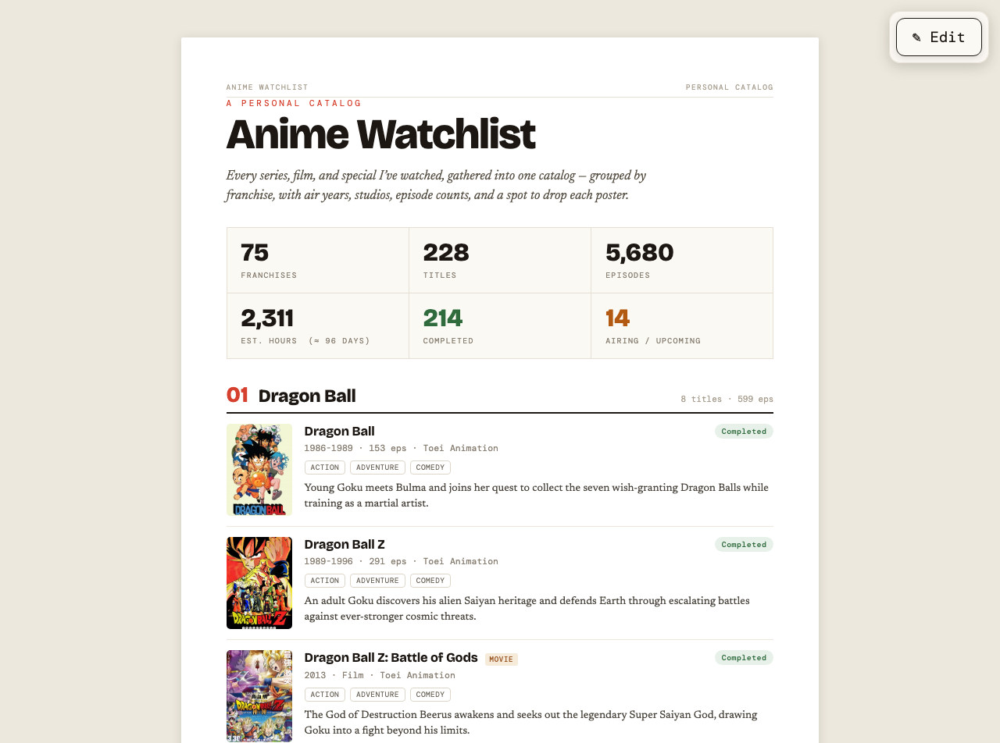

<div align="center">

# Anime Watchlist

**Every series, film, and special I've watched — one catalog, grouped by franchise.**

[](https://adith-senthil-kumar.github.io/Anime_list/)

[](https://adith-senthil-kumar.github.io/Anime_list/)
[](#offline)
[](#how-it-works)
[](#how-it-works)

### **[→ Open the app](https://adith-senthil-kumar.github.io/Anime_list/)**



</div>

---

## What it is

A personal anime catalog that runs as a single static page — no server, no
database, no build step. **75 franchises, 228 titles, 5,680 episodes**, each
with air years, studio, episode count, genres, a synopsis, and a poster.

It installs to your phone like a native app and works with no connection at
all.

## Features

|  | |
|---|---|
| **Installable** | Add to Home Screen on iOS or Android and it opens standalone, no browser chrome |
| **Fully offline** | Every asset — posters, fonts, even React — is precached, so it works in airplane mode |
| **Editable in place** | Tap **Edit** to change any field, add entries, or reorder franchises |
| **Drop your own posters** | Drag an image onto any slot; it's stored at full original quality |
| **Portable backups** | Export everything to one JSON file, including your posters, and import it anywhere |
| **Live stats** | Totals for episodes, watch time, completed and currently-airing recompute as you edit |

## Install it

| Platform | How |
|---|---|
| **iPhone / iPad** | Open in Safari → Share → **Add to Home Screen** |
| **Android** | Open in Chrome → menu → **Install app** |
| **Desktop** | Chrome or Edge → install icon in the address bar |

> On iOS, install **before** you start editing. A Home Screen app gets its own
> storage, separate from Safari, so edits made in the browser first won't
> follow it in.

## Editing

Tap **Edit** to make every field editable and turn on poster drop targets.
Changes save to that device immediately — there's no save button.

Posters you drop are kept at their **original resolution and encoding**, byte
for byte, with no re-compression. Use **Backup (.json)** to export the list and
your posters together, and **Import** to restore them on another device.
**Reset** discards everything local and restores the published list.

Nothing syncs between devices, and nothing leaves your browser — moving data
around is what Backup and Import are for.

## Offline

The service worker precaches all 295 assets on first visit, so every later
visit is served from disk whether or not you have a connection. That includes
the things a static site usually leaves on a CDN:

- **React and ReactDOM** are vendored into `vendor/`, since the app can't
  render without them. They're byte-identical to the upstream unpkg builds —
  their SHA-384 hashes match the SRI values `support.js` pins.
- **All three typefaces** (Bricolage Grotesque, DM Mono, Newsreader) are
  self-hosted in `fonts/`, because a cross-origin stylesheet and its font files
  can't be precached.

## How it works

No framework, no bundler, no `package.json` — open `index.html` and it runs.

```
index.html      the app: layout, stats, edit mode, backup/import
data.json       the watchlist itself
image-slot.js   <image-slot> custom element — drop, crop and persist posters
doc-page.js     page chrome
support.js      the small runtime that renders the templates
sw.js           service worker: precaches all 295 assets
vendor/         React + ReactDOM, vendored for offline
fonts/          self-hosted woff2 + @font-face CSS
images/         269 posters
```

**Where your data lives.** The published list ships in `data.json`. Your edits
are stored separately in `localStorage`, and posters you drop go to IndexedDB
(they're far too large for `localStorage`). Once you've made any edit, that
device reads your local copy and stops following `data.json` — **Reset** puts
it back on the published version.

### Working on it

```bash
git clone https://github.com/Adith-Senthil-kumar/Anime_list.git
cd Anime_list
python3 -m http.server 8731     # any static server; needs http:// for the service worker
```

The service worker is **cache-first**, so bump `CACHE` in `sw.js`
(`anime-watchlist-v3` → `v4`) whenever you change a file. Without that, anyone
who has already opened the app keeps the old copy indefinitely. Bumping it
purges the previous cache and refetches everything on the next visit.

While developing, unregister the worker in DevTools → Application → Service
Workers, or you'll spend a while wondering why your edits do nothing.

---

<div align="center">
<sub>Built as a static site · hosted on GitHub Pages · posters are the property of their respective studios</sub>
</div>
